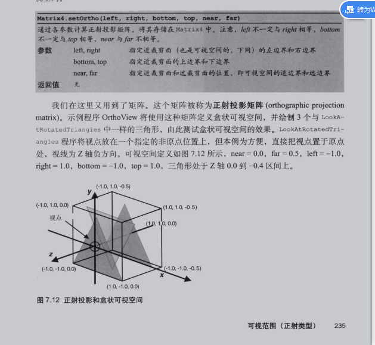
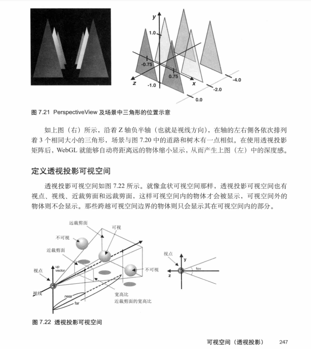

### 第二章
page-58:只能指定float类型的attribte变量，但是uniform可以是任意类型的
着色器程序需要提案加精度的设置 percision mduimp float 至少需要确定下来一个
记得在短代码后面加上分好 ; 否则会报错

```javascript   
    GLSL

    gl_Position： 内置变量，用来设置顶点坐标。
    gl_PointSize： 内置变量，用来设置顶点大小。
    vec2：2 维向量容器，可以存储 2 个浮点数。
    gl_FragColor： 内置变量，用来设置像素颜色。
    vec4：4 维向量容器，可以存储 4 个浮点数。
    precision：精度设置限定符，使用此限定符设置完精度后，之后所有该数据类型都将沿用该精度，除非单独设置。
    运算符：向量的对应位置进行运算，得到一个新的向量。
    vec * 浮点数： vec2(x, y) * 2.0 = vec(x * 2.0, y * 2.0)。
    vec2 * vec2：vec2(x1, y1) * vec2(x2, y2) = vec2(x1 * x2, y1 * y2)。
    加减乘除规则基本一致。但是要注意一点，如果参与运算的是两个 vec 向量，那么这两个 vec 的维数必须相同。
    JavaScript 程序如何连接着色器程序

    createShader：创建着色器对象
    shaderSource：提供着色器源码
    compileShader：编译着色器对象
    createProgram：创建着色器程序
    attachShader：绑定着色器对象
    linkProgram：链接着色器程序
    useProgram：启用着色器程序
    JavaScript 如何往着色器中传递数据

    getAttribLocation：找到着色器中的 attribute 变量地址。
    getUniformLocation：找到着色器中的 uniform 变量地址。
    vertexAttrib2f：给 attribute 变量传递两个浮点数。
    uniform4f：给uniform变量传递四个浮点数。
    WebGL 绘制函数

    drawArrays: 用指定的图元进行绘制。
    WebGL 图元

    gl.POINTS: 将绘制图元类型设置成点图元。

```
```javascript  
    //设置要清除背景的颜色
   gl.clearColor(0.0, 0.0, 0.0, 1.0);
   //启用背景清除功能
   gl.clear(gl.COLOR_BUFFER_BIT);


    //开启隐藏面 开始之后设置一遍即可
    gl.enable(gl.DEPTH_TEST);
    //启用清除深度缓冲区功能
    gl.clear(gl.DEPTH_BUFFER_BIT);

    //隐藏面
    gl.enable("可开启的内容"); 

    "可开启的内容":
    gl.DEPTH_TEST //隐藏面消除
    gl.BLEND //混合 
    gl.POLYGON_OFFSET_FILL //多边形位移

    //关闭上述功能
    gl.disable("可开启的内容")

```

### 矩阵的相乘

投影矩阵 * 视图矩阵 * 模型矩阵 * 顶点


投影矩阵是一部分
视图矩阵是一部分
模型矩阵是一部分
顶点是一部分

可以再顶点着色器中使用 视图矩阵 * 模型矩阵 * 顶点
也可以js的相乘之中使用  a = 视图矩阵 * 模型矩阵  然后再顶点着色器中使用这个   a * 顶点

gl_Position = 投影矩阵 * 视图矩阵 * 模型矩阵 * 顶点


当前 webGl编程指南 中使用的矩阵  

要实现 ： 视图矩阵 * 模型矩阵 

```javascript   
   //创建矩阵
    var modelViewMat4 = new Matrix4();
    // //这是视点
    modelViewMat4.setLookAt(yesX, yesY, yesZ, 0, 0, -1, 0, 1, 0);
    //这个是模型矩阵
    var modelMat = new Matrix4();
    modelMat.setRotate(rotateAngle, 0, 0, 1);
    //将将矩阵计算   左边 * 右边 的 方式
    //要实现 ： 视图矩阵 * 模型矩阵
    modelViewMat4.multiply(modelMat);

```

### 观察点


### 投影方式
#### 正交投影(page235) 
>不区分远近 
>Matrix4.setOrho(left,right,bottom,top,near,far)



#### 透视投影(page247) 
>区分远近
>Matrix4.setPerspective(fov,aspect,near,far)



